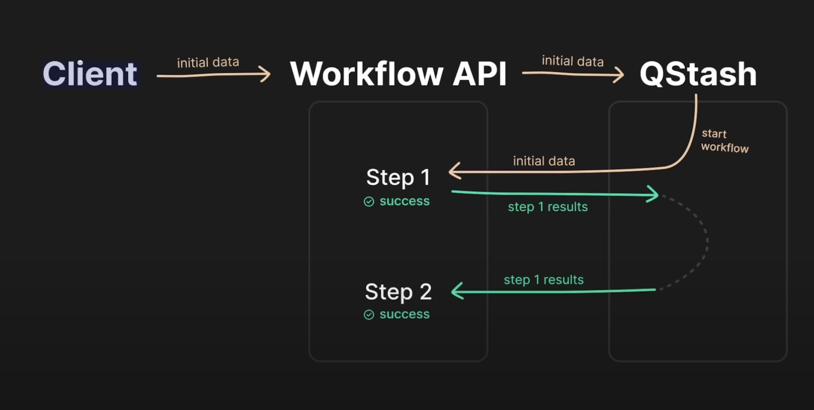
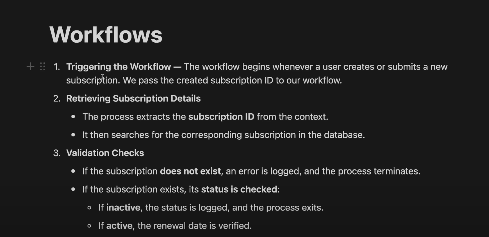
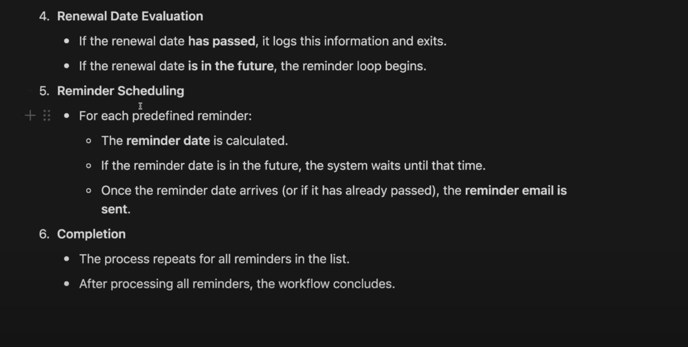

# Subscription Management System

A robust Node.js backend API for managing user subscriptions with automated renewal reminders and comprehensive security features.

## Features

- **User Authentication**: JWT-based sign up, sign in, and secure session management
- **Subscription Management**: Full CRUD operations for user subscriptions
- **Automated Workflows**: Smart reminder system using Upstash Workflows that sends emails 7, 5, 2, and 1 days before renewal
- **Security**: Rate limiting, bot detection, and request protection via Arcjet
- **Email Notifications**: Automated reminder emails using Nodemailer
- **Data Validation**: Comprehensive input validation and error handling
- **Status Tracking**: Automatic subscription status updates (active, cancelled, expired)

## Tech Stack

- **Runtime**: Node.js with Express.js
- **Database**: MongoDB with Mongoose ODM
- **Authentication**: JWT with bcryptjs for password hashing
- **Workflows**: Upstash Workflow for automated reminder scheduling
- **Security**: Arcjet for rate limiting and bot protection
- **Email**: Nodemailer for email notifications
- **Date Handling**: Day.js for date calculations
- **Environment**: dotenv for configuration management

## Installation

1. Clone the repository:
```bash
git clone <repository-url>
cd Subscription-Management-System
```

2. Install dependencies:
```bash
npm install
```

3. Create environment file:
```bash
cp .env.development.local.example .env.development.local
```

4. Configure your environment variables in `.env.development.local`:
```env
PORT=3000
SERVER_URL=http://localhost:3000
NODE_ENV=development
DB_URI=mongodb://localhost:27017/subscription-management
JWT_SECRET=your-jwt-secret
JWT_EXPIRES_IN=7d
ARCJET_KEY=your-arcjet-key
ARCJET_ENV=development
QSTASH_URL=your-qstash-url
QSTASH_TOKEN=your-qstash-token
EMAIL_PASSWORD=your-email-app-password
```

5. Start the development server:
```bash
npm run dev
```

## API Endpoints

### Authentication
- `POST /api/v1/auth/sign-up` - User registration
- `POST /api/v1/auth/sign-in` - User login
- `POST /api/v1/auth/sign-out` - User logout

### Users
- `GET /api/v1/users` - Get all users (protected)
- `GET /api/v1/users/:id` - Get user by ID (protected)

### Subscriptions
- `GET /api/v1/subscriptions` - Get user's subscriptions (protected)
- `POST /api/v1/subscriptions` - Create new subscription (protected)
- `GET /api/v1/subscriptions/:id` - Get subscription by ID (protected)
- `PUT /api/v1/subscriptions/:id` - Update subscription (protected)
- `DELETE /api/v1/subscriptions/:id` - Delete subscription (protected)

### Workflows
- `POST /api/v1/workflows/subscription/reminder` - Trigger reminder workflow (internal)

## Subscription Workflow

When a new subscription is created, the system automatically:

1. **Triggers Workflow**: Starts an Upstash workflow for the subscription
2. **Validates Status**: Checks if subscription is active and renewal date is valid
3. **Schedules Reminders**: Sets up reminders for 7, 5, 2, and 1 days before renewal
4. **Sends Emails**: Automatically sends reminder emails at scheduled times
5. **Status Management**: Updates subscription status based on renewal dates

## Project Structure

```
├── config/           # Configuration files
├── controllers/      # Request handlers
├── database/         # Database connection
├── middleware/       # Custom middleware
├── models/          # Database schemas
├── routes/          # API route definitions
├── utils/           # Utility functions
└── public/          # Static assets
```

## Security Features

- **Rate Limiting**: 5 requests per 10 seconds per IP
- **Bot Detection**: Automatic bot detection and blocking
- **Input Validation**: Comprehensive data validation
- **JWT Protection**: Secure token-based authentication
- **Error Handling**: Centralized error management

## Development

```bash
# Start development server
npm run dev

# Start production server
npm start

# Lint code
npx eslint .
```

## Screenshots





## License

ISC
